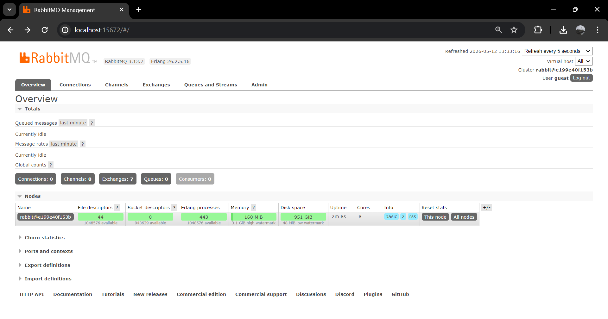
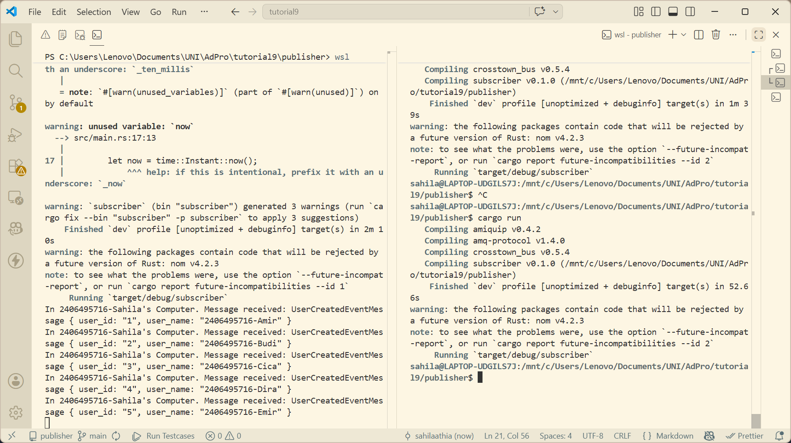
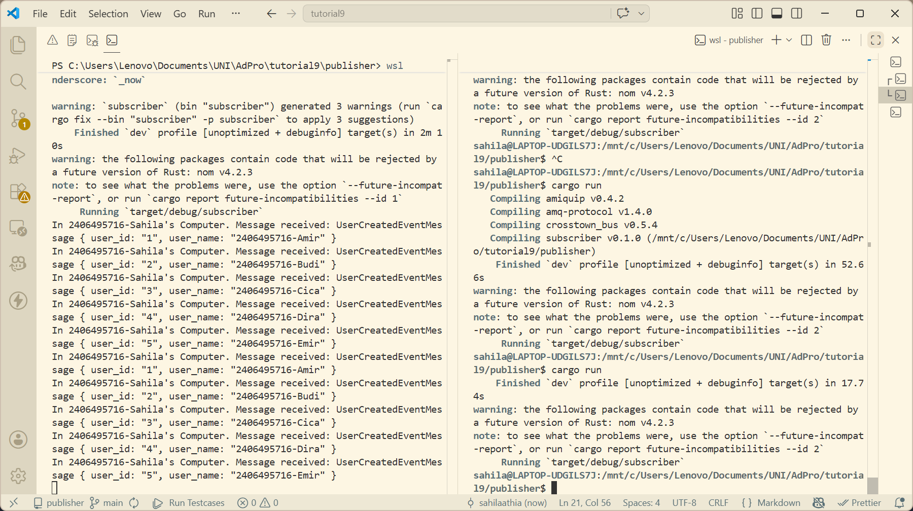
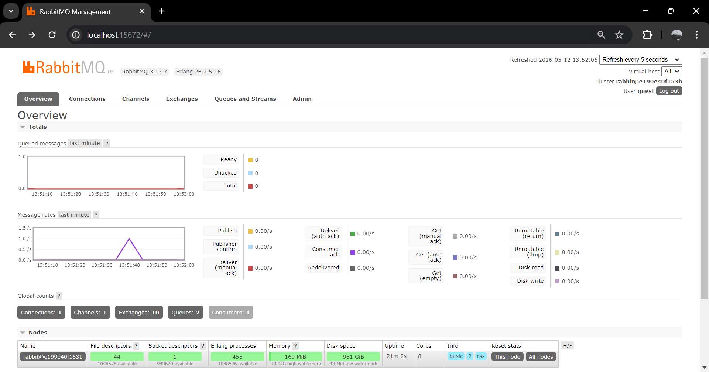
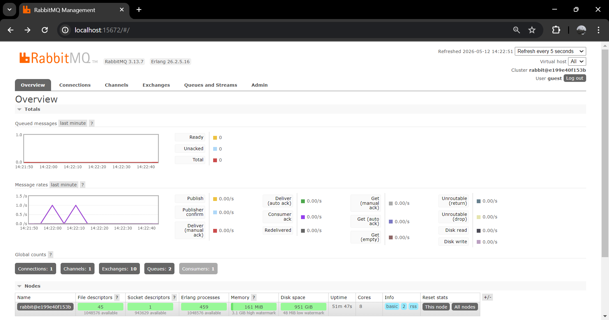
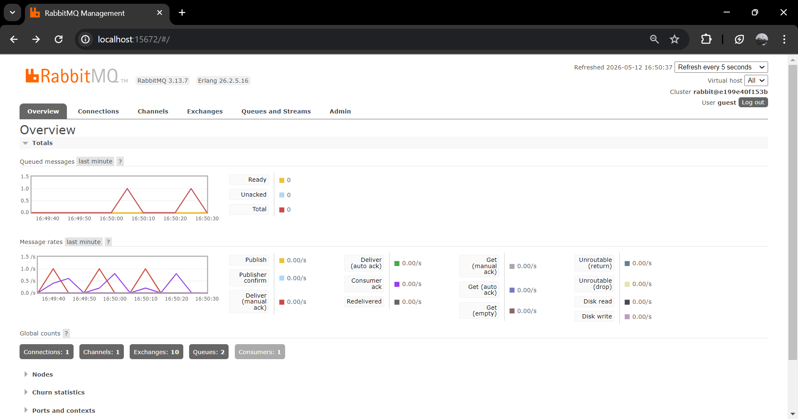
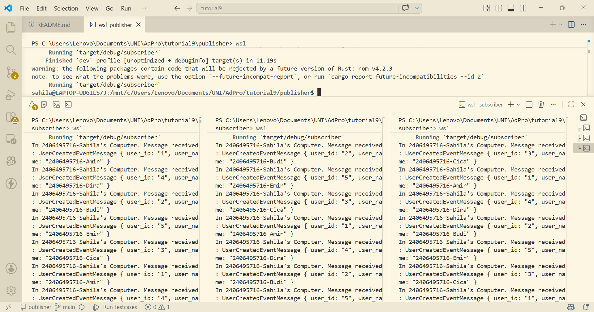
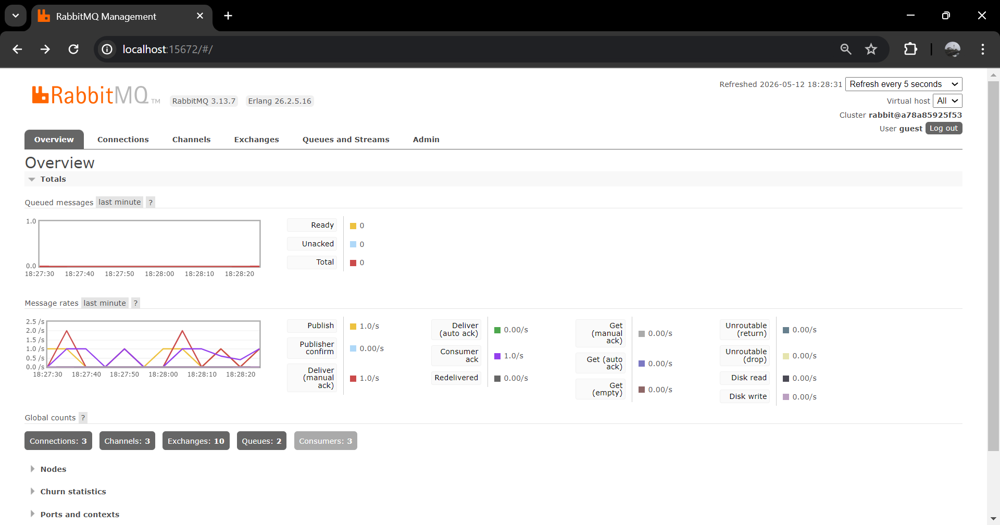

# Subscriber

## What is amqp?

AMQP (Advanced Message Queuing Protocol) adalah protokol komunikasi yang digunakan untuk bertukar pesan antar program di mana pengirim dan penerima pesan tidak perlu terhubung langsung. Mirip seperti HTTP yang dipakai browser untuk request ke server, AMQP ini khusus dipakai untuk komunikasi melalui message broker seperti RabbitMQ. Protokol ini yang mengatur bagaimana cara koneksi, format datanya, sampai konfirmasi bahwa pesan sudah diterima.

## What does `guest:guest@localhost:5672` mean?

- `guest` (pertama): username untuk login ke RabbitMQ
- `guest` (kedua): password untuk login ke RabbitMQ
- `localhost`: alamat server RabbitMQ nya, dalam hal ini di komputer kita sendiri (local)
- `5672`: port yang dipakai RabbitMQ untuk menerima koneksi

Intinya, itu adalah connection string untuk connect/login ke RabbitMQ. Format: username:password@host:port

## Running RabbitMQ as Message Broker

## Sending and Processing Event

Ketika publisher dijalankan (`cargo run` di directory publisher), publisher mengirim 5 event sekaligus ke queue `user_created` di RabbitMQ. Setiap event berisi data `user_id` (1-5) dan `user_name` (2406495716-Amir sampai 2406495716-Emir). Setelah selesai kirim, publisher langsung berhenti dengan sendirinya.

Subscriber yang terus berjalan, langsung menerima dan memproses 5 pesan tersebut satu per satu. Dapat terlihat di console subscriber ada 5 baris output.

## RabbitMQ Chart

Ketika publisher di-run sekali, terlihat 1 spike ungu di grafik message rates. Spike ungu menunjukkan RabbitMQ menerima 5 event sekaligus dari publisher, lalu langsung diteruskan ke subscriber, kemudian grafik turun kembali ke 0. Grafik queued messages tetap 0 karena tidak ada penumpukan pesan.

Ketika publisher di-run 2 kali berturut-turut, terlihat 2 spike ungu di grafik message rates, satu spike per satu kali run publisher. Masing-masing spike langsung turun ke 0 karena subscriber masih cukup cepat memproses semua pesan sebelum publisher di-run lagi.

## Simulation Slow Subscriber

Terlihat pada grafik queued messages terdapat spike yang naik hingga 1.0, artinya pesan sempat menumpuk di RabbitMQ karena subscriber tidak bisa langsung memproses semua pesan yang masuk. Berbeda dengan sebelumnya di mana grafik queued messages selalu flat di 0 karena subscriber cukup cepat. Jadi meskipun subscriber lambat, sistem tidak crash dan pesan tidak hilang karena RabbitMQ menyimpan pesan di queue, publisher juga tidak perlu menunggu subscriber selesai.

## Running at Least Three Subscribers

Ketika menjalankan 3 subscribers sekaligus, pesan yang dikirim publisher langsung dibagi-bagikan oleh RabbitMQ ke ketiga subscriber secara round-robin. Terlihat di terminal bahwa masing-masing subscriber menerima pesan yang berbeda-beda (tidak ada pesan yang diproses dua kali oleh subscriber yang berbeda).

Di bagian global counts, dapat terlihat Connections, Channels, dan Consumers semuanya berubah menjadi 3, sesuai dengan adanya 3 subscriber aktif yang terhubung. Grafik queued messages tetap flat di 0 meskipun subscriber masih lambat, karena beban pemrosesan dibagi ke 3 subscriber secara paralel. Menambah jumlah subscriber bisa menjadi solusi subscriber lambat.